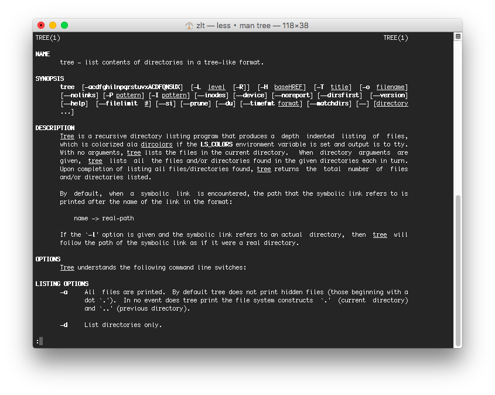
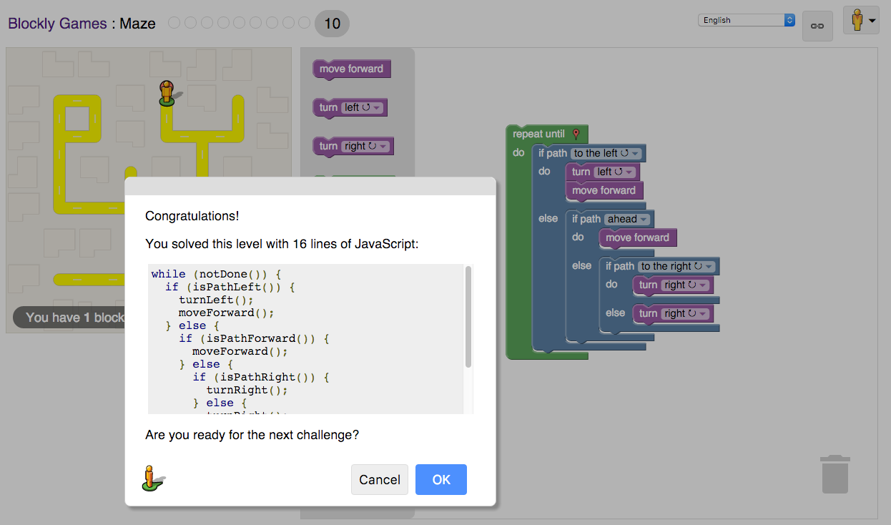

# Lab 1  Friday 29th January 2016 (in class lab)

## Reflection On the Open Source Definition
The 10 criteria are important because they provide the set of rules for the open source community to understand the idea behind open source, which allows softwares to be developed, improved, distributed, used by everyone.
## Reflection on How to Ask the Question the Smart Way
-Reading through the article, I realize I've been asking question the wrong way the whole time. I've made tons of mistakes such as not giving a meaningful, specific subject headers, shotgun-blast the question to all the available help channels at once, given a large amount of detail and think that's being precise and informative, and etc. I felt I've learned a lot, and believe I will think once more next time I post questions.
-Suggestions on Answer Questions In a Helpful Way: 1) provide answer/direction with details. Often a problem might seem obvious to you, but that doesn't necessarily mean it's also obvious to the questioner. providing some explanation/pointer to specific knowledge/subject specific vocabulary would be very helpful, or least will not confuse the questioner as much. 2) if you are an audience of the question, but don't necessarily know how to answer the question, however, you happened to know an expert of the field the question belongs to, it would be a courtesy to expose the question the the expert.
## Regex

## Tree

## Blocky Game

## Reflection
A project I will be interested in working on a platform which people can rate rental properties like how people rate professors on ratemyprofessors.com. The incentive behind this platform is that I had a very bad experience with my off-campus housing. It would be really helpful to have a such rating platform in aid while finding a place to rent.
I think this lab was relatively easy. I've had experience with Git and Github. The Regex problem set was excellent and refreshed my knowledge on regex.